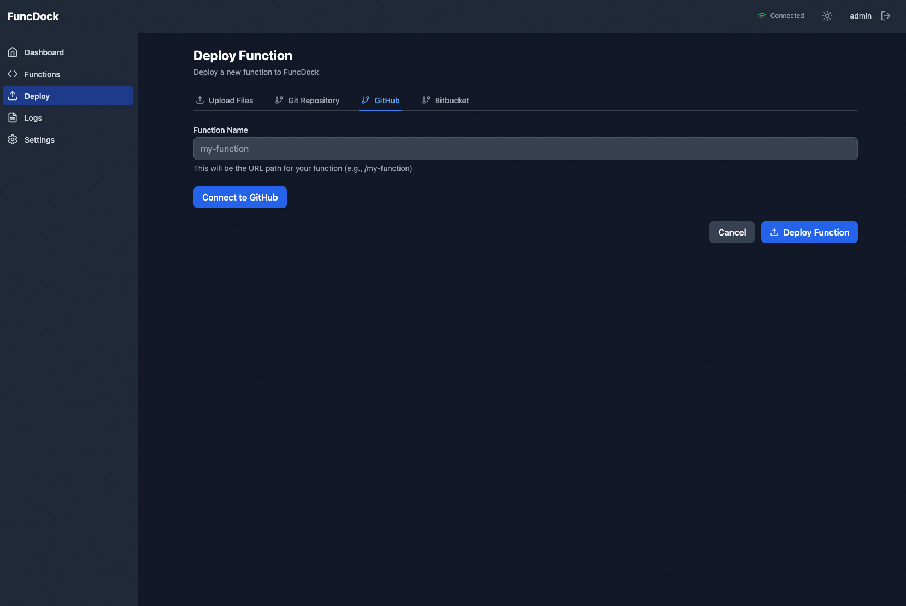
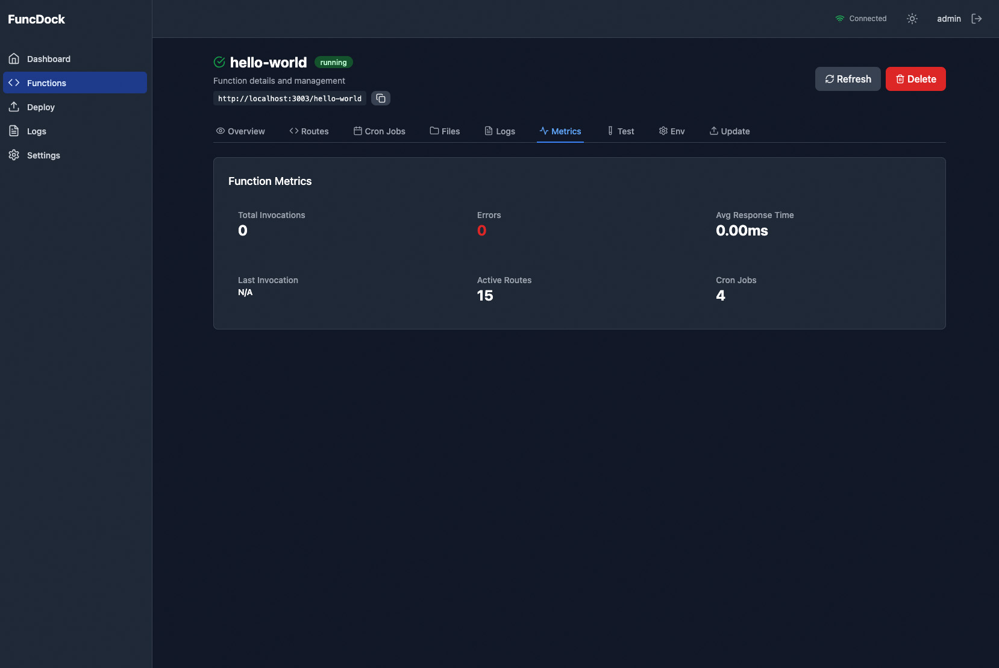
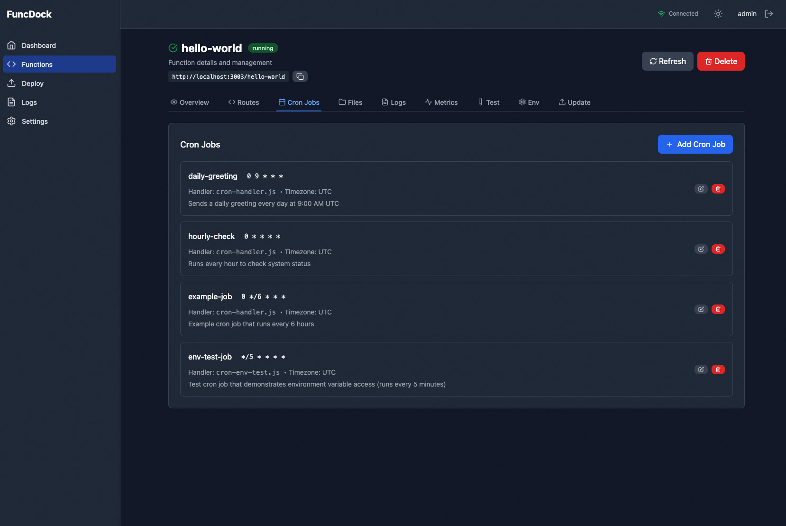
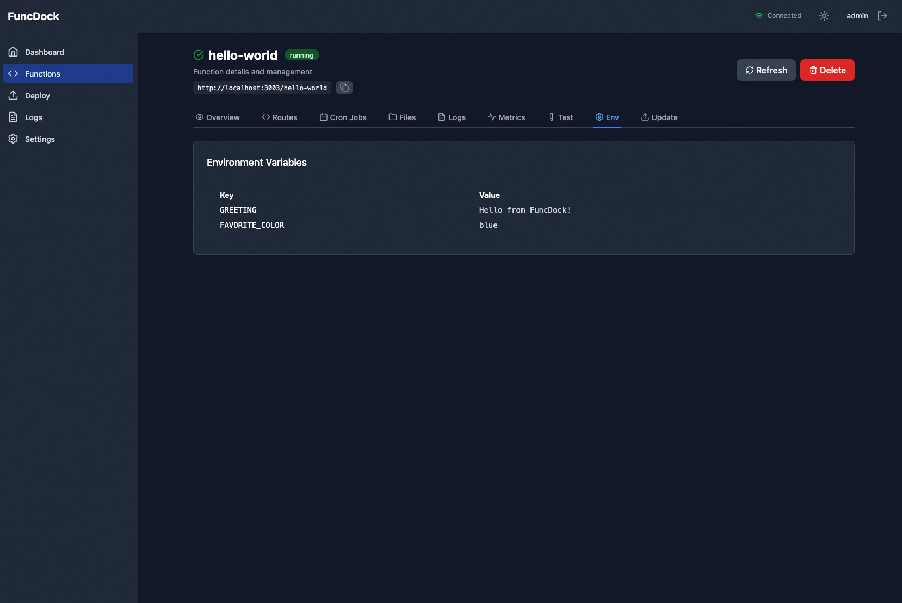

# FuncDock

<p align="center">
  <strong>Serverless Functions + MCP Tools in a Single Container</strong>
</p>

<p align="center">
  <a href="https://github.com/reaatech/funcdock/releases"></a>
  <a href="LICENSE"></a>
  
  
  
</p>

<p align="center">
  Run dozens of Node.js functions with <strong>zero cold starts</strong>, <strong>hot reload</strong>, and <strong>automatic MCP tool exposure</strong>.
</p>

---

## What is FuncDock?

FuncDock is a self-hosted Function-as-a-Service (FaaS) platform that runs multiple Node.js functions inside a single Docker container. It gives you the ergonomics of serverless — per-function routing, environment isolation, and independent deployments — without the cold starts, vendor lock-in, or per-request billing of cloud functions.

Every function route is automatically exposed as an [MCP (Model Context Protocol)](https://modelcontextprotocol.io) tool, making FuncDock an ideal backend for AI agents and LLM-powered applications.

Built for teams who want:

- **Predictable infrastructure** — one container, many functions, no orchestration magic
- **Developer velocity** — file-watch hot reload, TypeScript without a build step, a built-in React dashboard
- **AI-ready APIs** — your functions become MCP tools that any compatible client can discover and invoke
- **Observability out of the box** — OpenTelemetry tracing, structured logs, per-function metrics, and Slack alerts

---

## Features

|     | Feature               | Description                                                                                  |
| --- | --------------------- | -------------------------------------------------------------------------------------------- |
| ⚡  | **Zero Cold Starts**  | All functions run in one Node.js process. No container spin-up, no latency spikes.           |
| 🔥  | **Hot Reload**        | Edit a file. Save. The function reloads in milliseconds. No server restart.                  |
| 🤖  | **MCP Server**        | Every route auto-exposes as an MCP tool. LLMs can discover and call your functions natively. |
| 📊  | **React Dashboard**   | Real-time function monitoring, logs, metrics, env editing, and deployment UI.                |
| 🧪  | **Built-in Testing**  | Jest with ESM support. Test locally or in a production-identical Docker container.           |
| 🔐  | **Security First**    | httpOnly cookies, rate limiting, Helmet, input validation, and token blacklisting.           |
| 📦  | **Shared Layers**     | Lambda-style code sharing. One symlinked layer, many functions. Change once, reload all.     |
| 📝  | **TypeScript Native** | Write `.ts` handlers. `tsx` compiles on the fly. No build step required.                     |
| 🔍  | **OpenTelemetry**     | Distributed tracing with automatic span wrapping on every function invocation.               |
| 🚀  | **Multi-deployment**  | Deploy from Git, local path, dashboard upload, PR, or CI/CD with an API key.                 |

---

## Quick Start

### 1. Clone & Configure

```bash
git clone https://github.com/reaatech/funcdock.git
cd funcdock
cp .env.example .env
# Edit .env and set JWT_SECRET, ADMIN_USERNAME, and ADMIN_PASSWORD
```

### 2. Install & Start

```bash
npm install
npm run dev
```

The dev server starts on `http://localhost:3000` with file watching enabled.

### 3. Create a Function

```bash
npx funcdock create my-api
```

This scaffolds:

```
functions/my-api/
├── handler.js
├── handler.test.mjs
├── route.config.json
├── package.json
└── README.md
```

### 4. Test It

```bash
curl http://localhost:3000/my-api/
# → { "message": "Hello from my-api!" }
```

### 5. Open the Dashboard

Visit `http://localhost:3000/dashboard`, log in with your admin credentials, and manage functions in real time.

---

## Architecture

FuncDock avoids Express router stack bloat by using a **custom Map-based dispatcher**. Instead of registering routes with `app.use()` (which leaks middleware on every hot reload), a single middleware looks up handlers in a `Map` keyed by `"METHOD /path"`.

```
HTTP Request
    │
    ▼
Express middleware (helmet, cors, json)
    │
    ▼
functionDispatcherMiddleware ──→ Map lookup: "GET /my-api/"
    │                              Inject: logger, env, functionName
    ▼                           Wrap in OpenTelemetry span
Handler executes
    │
    ▼
Response + structured access log
```

This gives **O(1) route lookup** and **zero Express stack pollution** across unlimited reloads.

For the full design doc, see [`ARCHITECTURE.md`](ARCHITECTURE.md).

---

## Function Development

### Handler Pattern

Functions are plain ES modules that export a default async handler:

```javascript
// functions/my-api/handler.js
export default async function handler(req, res) {
  const { logger, env, method, query, body } = req;

  logger.info(`Received ${method}`, { query });

  res.json({
    message: 'Hello from my-api',
    envHasKey: !!env.API_KEY,
  });
}
```

### Route Configuration

```json
// functions/my-api/route.config.json
{
  "base": "/my-api",
  "handler": "handler.js",
  "routes": [
    { "path": "/", "methods": ["GET", "POST"] },
    { "path": "/:id", "methods": ["GET", "PUT", "DELETE"] }
  ]
}
```

### Environment Variables

Add a `.env` file inside your function directory:

```bash
# functions/my-api/.env
API_KEY=sk-123456
DATABASE_URL=postgres://localhost/mydb
```

Access them via `req.env` in your handler.

### Cron Jobs

```json
// functions/my-api/cron.json
{
  "jobs": [
    {
      "name": "daily-report",
      "schedule": "0 9 * * *",
      "handler": "cron-handler.js",
      "description": "Generate daily report at 9am"
    }
  ]
}
```

### Shared Layers

Create a layer in `layers/shared-utils/` with a `nodejs/` directory. Reference it from your function:

```json
// functions/my-api/layers.json
"shared-utils"
```

The layer is symlinked into `node_modules/shared-utils` automatically.

### TypeScript

Write `.ts` handlers directly. No build step.

```typescript
// functions/my-api/handler.ts
import type { Request, Response } from 'express';

export default async function handler(req: Request, res: Response) {
  res.json({ ok: true });
}
```

---

## MCP Server

FuncDock ships with a built-in MCP server that exposes **every loaded function route as an MCP tool**.

- **Enable it:** `MCP_ENABLED=true` (default)
- **HTTP transport:** port `3001` (configurable via `MCP_HTTP_PORT`)
- **Stdio transport:** supported for local MCP clients
- **Tool naming:** `{functionName}__{route_path}__{method}`

Example tool name: `hello-world__greet__get`

### Securing MCP HTTP

By default, MCP HTTP binds to `127.0.0.1` only. To expose externally, set `MCP_API_KEY`:

```bash
MCP_HTTP_HOST=0.0.0.0
MCP_API_KEY=your-strong-random-key
```

Clients must send `Authorization: Bearer <MCP_API_KEY>`.

---

## Dashboard

The React 19 + Vite dashboard provides real-time management:

- **Functions** — list, status, route counts, layer associations
- **Logs** — per-function structured logs with filtering
- **Metrics** — invocation counts, error rates, response times
- **Deploy** — upload files, connect GitHub/Bitbucket repos, deploy from PRs
- **Cron Jobs** — view schedules, last run status
- **MCP Status** — connected transports, exposed tools
- **Settings** — dark/light mode, environment editor

Real-time updates are pushed via Socket.IO. Screenshots are in [`screenshots/`](screenshots/).

---

## CLI Reference

The `funcdock` CLI replaces Makefile-driven workflows:

| Command                                        | Description                              |
| ---------------------------------------------- | ---------------------------------------- |
| `funcdock dev`                                 | Start development server with hot reload |
| `funcdock start`                               | Start production server                  |
| `funcdock create <name>`                       | Scaffold a new function                  |
| `funcdock deploy --git <url> --name <name>`    | Deploy from Git                          |
| `funcdock deploy --local <path> --name <name>` | Deploy from local path                   |
| `funcdock update <name>`                       | Update an existing function              |
| `funcdock remove <name>`                       | Remove a function                        |
| `funcdock list`                                | List all deployed functions              |
| `funcdock test [function]`                     | Run Jest tests                           |
| `funcdock logs`                                | View application logs                    |
| `funcdock status`                              | Check platform health                    |
| `funcdock reload`                              | Hot reload all functions                 |

Every command supports `--help`. See [`docs/CLI_README.md`](docs/CLI_README.md) for full details.

---

## Docker

### Development

```bash
docker-compose up
```

Mounts `functions/` and `logs/` as volumes. Redis is bundled inside the container.

### Production

```bash
docker-compose --profile production up --build -d
```

Includes a Caddy reverse proxy with automatic HTTPS.

### Manual

```bash
docker build -t funcdock .
docker run -p 3000:3000 -v $(pwd)/functions:/app/functions funcdock
```

The image is based on `node:22-slim` and includes Git and Redis.

---

## Configuration

### Required

| Variable         | Description                                 |
| ---------------- | ------------------------------------------- |
| `JWT_SECRET`     | Min 16 chars. Used to sign session tokens.  |
| `ADMIN_USERNAME` | Dashboard login username.                   |
| `ADMIN_PASSWORD` | Min 8 chars. Hashed with bcrypt at startup. |

### Optional

| Variable                         | Default             | Description                                  |
| -------------------------------- | ------------------- | -------------------------------------------- |
| `PORT`                           | `3000`              | HTTP server port.                            |
| `NODE_ENV`                       | `development`       | `development` or `production`.               |
| `LOG_LEVEL`                      | `info`              | `debug`, `info`, `warn`, `error`, `alert`.   |
| `MCP_ENABLED`                    | `true`              | Start the MCP server.                        |
| `MCP_HTTP_PORT`                  | `3001`              | MCP HTTP transport port.                     |
| `MCP_HTTP_HOST`                  | `127.0.0.1`         | Bind address for MCP HTTP.                   |
| `MCP_API_KEY`                    | —                   | Bearer token required if exposed externally. |
| `DEPLOY_API_KEY`                 | —                   | CI/CD key that bypasses JWT auth.            |
| `GITHUB_CLIENT_ID` / `SECRET`    | —                   | OAuth for GitHub repo integration.           |
| `BITBUCKET_CLIENT_ID` / `SECRET` | —                   | OAuth for Bitbucket repo integration.        |
| `SLACK_WEBHOOK_URL`              | —                   | Alert notifications channel.                 |
| `OTEL_EXPORTER_OTLP_ENDPOINT`    | —                   | OpenTelemetry collector URL.                 |
| `CORS_ORIGIN`                    | `*`                 | Comma-separated allowed origins.             |
| `REDIS_PASSWORD`                 | `funcdock_internal` | Redis auth (Docker).                         |

See [`.env.example`](.env.example) for the full template.

---

## Testing

```bash
# All tests
npm test

# With coverage
npm run test:coverage

# Single function
npm test -- functions/hello-world

# Production-identical Docker test
funcdock test hello-world --docker
```

Tests use Jest with `--experimental-vm-modules` and ESM. Helper utilities are in [`test/setup.mjs`](test/setup.mjs).

---

## Security

- **Authentication:** JWT via httpOnly cookie (`funcdock-token`) or `Authorization: Bearer` header. Dual support for SPAs and API clients.
- **Rate Limiting:** 100 requests per 15 minutes on `/api/`. Login endpoint limited to 5 attempts.
- **Input Validation:** Strict regex validators for Git URLs, branch names, commit SHAs, function names, and file paths.
- **Headers:** Helmet with CSP. CORS configured per environment. Compression enabled.
- **Logout:** Token blacklist with automatic TTL cleanup. Ready for Redis-backed multi-instance deployments.
- **Secrets:** Per-function `.env` files. No secrets in `localStorage`.

See [`docs/SECURITY_README.md`](docs/SECURITY_README.md) for hardening guides.

---

## Documentation

| Doc                                                                | What you'll learn                               |
| ------------------------------------------------------------------ | ----------------------------------------------- |
| [`docs/SETUP_README.md`](docs/SETUP_README.md)                     | Full installation, Redis setup, first run       |
| [`docs/DEPLOYMENT_README.md`](docs/DEPLOYMENT_README.md)           | Git, local, dashboard, PR, and CI/CD deployment |
| [`docs/CLI_README.md`](docs/CLI_README.md)                         | Complete CLI command reference                  |
| [`docs/DASHBOARDS_README.md`](docs/DASHBOARDS_README.md)           | Dashboard features and navigation               |
| [`docs/CRONJOBS_README.md`](docs/CRONJOBS_README.md)               | Scheduled jobs and cron patterns                |
| [`docs/LAYERS_README.md`](docs/LAYERS_README.md)                   | Creating and managing shared layers             |
| [`docs/TESTING_README.md`](docs/TESTING_README.md)                 | Test patterns, coverage, Docker tests           |
| [`docs/SECURITY_README.md`](docs/SECURITY_README.md)               | Auth, rate limiting, secrets management         |
| [`docs/TROUBLESHOOTING_README.md`](docs/TROUBLESHOOTING_README.md) | Common issues and fixes                         |
| [`ARCHITECTURE.md`](ARCHITECTURE.md)                               | System design, data flow, key decisions         |
| [`CONTRIBUTING.md`](CONTRIBUTING.md)                               | How to contribute                               |

---

## Screenshots

| Dashboard                               | Deploy                                           | Function Logs                          |
| --------------------------------------- | ------------------------------------------------ | -------------------------------------- |
|  |  |  |

| Metrics                                      | Cron Jobs                              | Environment                          |
| -------------------------------------------- | -------------------------------------- | ------------------------------------ |
|  |  |  |

More in [`screenshots/`](screenshots/).

---

## Changelog

See [`CHANGELOG.md`](CHANGELOG.md) for version history and migration notes.

---

## Contributing

Contributions are welcome. Please read [`CONTRIBUTING.md`](CONTRIBUTING.md) and run `npm test` before opening a PR.

---

## License

MIT © [REAA Technologies](https://github.com/reaatech)
