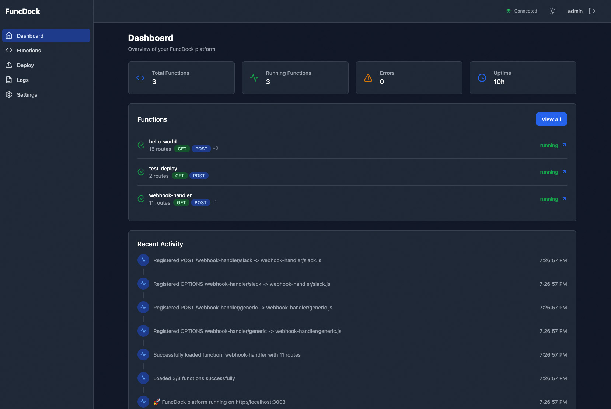
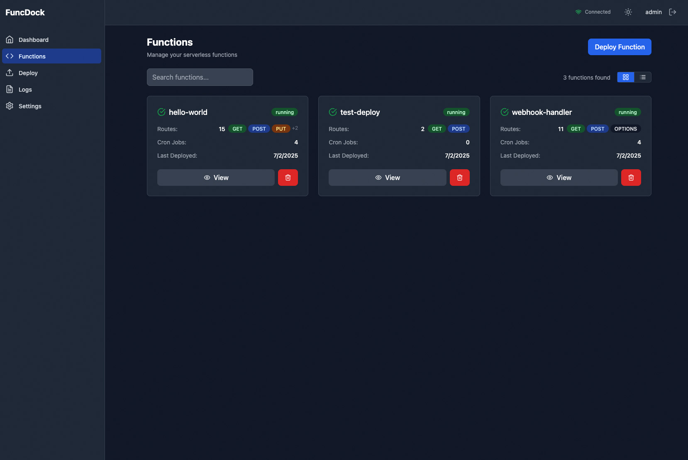
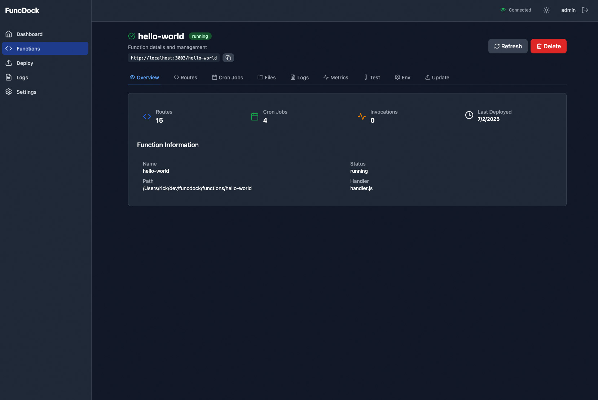
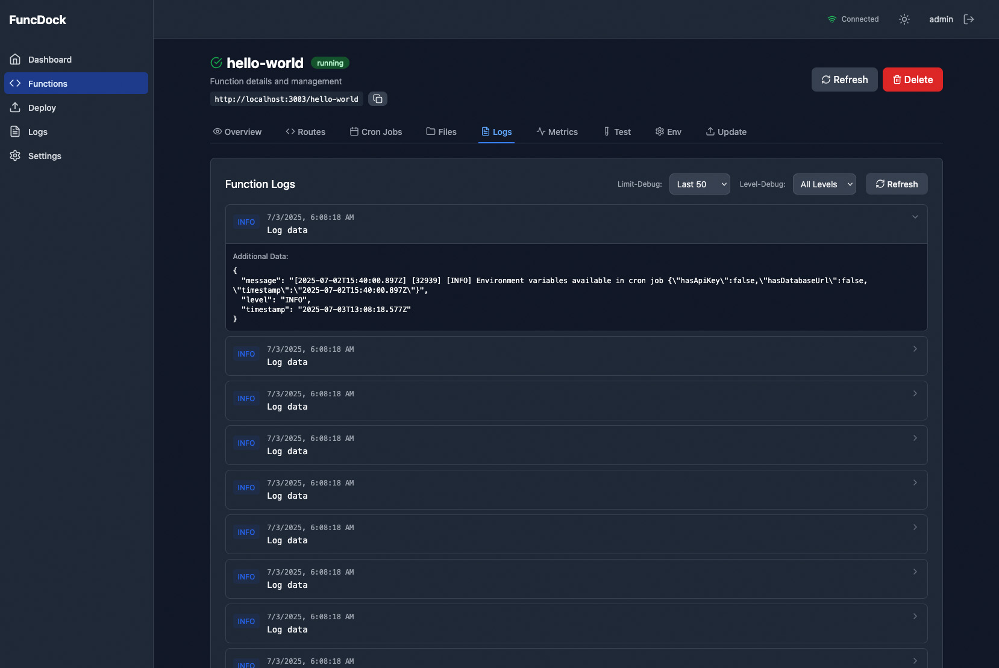

# 🚀 FuncDock — The Ultimate Node.js FaaS Platform

## 📚 Documentation Index

- [SETUP](docs/SETUP_README.md)
- [USAGE](docs/USAGE_README.md)
- [DEPLOYMENT](docs/DEPLOYMENT_README.md)
- [CLI](docs/CLI_README.md)
- [CRON JOBS](docs/CRONJOBS_README.md)
- [DASHBOARDS](docs/DASHBOARDS_README.md)
- [TESTING](docs/TESTING_README.md)
- [TROUBLESHOOTING](docs/TROUBLESHOOTING_README.md)
- [SECURITY](docs/SECURITY_README.md)
- [ARCHITECTURE](ARCHITECTURE.md) — System design and component interactions
- [AGENTS](AGENTS.md) — Development conventions for AI coding agents
- [CONTRIBUTING](CONTRIBUTING.md) — How to contribute

---

> **The first serverless platform with INSTANT hot reload, CI/CD deployments, per-route handlers, real-time dashboards, and production-grade testing — all your functions in one blazing-fast container.**

---

## 🔥 The FaaS Problem Everyone Faces

**Sound familiar?**

- 😩 Change one line → wait 5 minutes for cold deployment
- 🐌 Different dev/prod environments = endless debugging nightmares
- 💸 Pay per function, per container, per lambda invocation
- 🌪️ Functions scattered across 20+ services = management chaos
- 📊 Zero visibility into what's actually happening in production
- 🧪 Testing serverless functions locally = impossible
- 🔄 Route changes require full redeployment cycles

**There had to be a revolutionary solution...**

---

## 🤯 FuncDock: The Serverless Game Changer

We didn't just build another FaaS platform — we **reimagined serverless development** from the ground up:

### ⚡️ **INSTANT Hot Reload** — Industry's First

Deploy your code and see it live in **milliseconds**. No container restarts, no downtime, no waiting. Git push → CI/CD deploys → functions hot reload instantly in production. Or deploy manually via CLI/dashboard and watch changes go live immediately. This changes everything about serverless deployment.

### 🎯 **Per-Route Handlers** — Revolutionary Architecture

Unlike every other platform, each route can have its own handler file. `/api` uses `api.js`, `/webhook` uses `webhook.js`, `/users/:id` uses `users.js`. Maximum code organization, zero complexity.

### 🎛️ **Live Real-Time Dashboard** — Complete Visibility

Watch your functions breathe with streaming logs, live metrics, route health monitoring, and cron job execution. Finally see what's happening in your serverless world in real-time.

### 🏠 **All Functions, One Container** — Cost Revolution

Why manage 50 containers when one lightning-fast container can run everything? **80% cost reduction** with zero architectural complexity.

### 🧪 **Production-Grade Testing** — With Docker Parity

Jest + Nock testing that runs in identical Docker environments. Test locally, deploy with confidence. No more "works on my machine" disasters.

### 🎛️ **Middleware Support** — Handlers can use Express-style middleware by calling next().

---

## 🚀 Why Developers Are Obsessed

- **⚡ INSTANT HOT RELOAD** — Deploy → changes live in milliseconds (no other platform has this)
- **🚀 CI/CD READY** — Git push → test → deploy → hot reload in production with zero downtime
- **🎯 PER-ROUTE HANDLERS** — `/api` → `api.js`, `/users` → `users.js` (revolutionary organization)
- **👁️ REAL-TIME EVERYTHING** — Live logs, metrics, cron monitoring, route health
- **💡 ZERO CONFIG MAGIC** — Drop functions in, start coding, deploy anywhere
- **🐳 PERFECT DEV-PROD PARITY** — Same Docker environment locally and production
- **⏰ SMART CRON JOBS** — Per-function scheduling with timezone support and hot reload
- **🧪 PRODUCTION TESTING** — Jest + Nock in Docker containers matching production
- **🔒 ENTERPRISE READY** — Route conflict prevention, webhook validation, security headers
- **💰 MASSIVE COST SAVINGS** — One container to rule them all
- **🎨 PURE DEVELOPER JOY** — From idea to production in under 60 seconds

---

## ⚡️ Experience the Magic

### 1. Write a Function (Pure Simplicity)

```js
// functions/hello-world/handler.js
export default async function handler(req, res, next) {
  const { logger, env, method, query } = req;
  logger.info('Hello handler called', { method, env: !!env });
  res.json({
    message: `Hello, ${query.name || 'World'}!`,
    env: env.MY_SECRET,
    time: new Date().toISOString(),
  });
  // Call next() if you want to pass control to additional middleware
}
```

### 2. Configure Advanced Routing

```json
// functions/hello-world/route.config.json
{
  "base": "/hello-world",
  "handler": "handler.js",
  "routes": [
    { "path": "/", "methods": ["GET"] },
    { "path": "/api", "handler": "api.js", "methods": ["POST"] },
    { "path": "/webhook", "handler": "webhook.js", "methods": ["POST"] },
    { "path": "/users/:id", "handler": "users.js", "methods": ["GET", "PUT"] }
  ]
}
```

### 3. Add Intelligent Cron Jobs

```json
// functions/hello-world/cron.json
{
  "jobs": [
    {
      "name": "daily-backup",
      "schedule": "0 2 * * *",
      "handler": "cron-handler.js",
      "timezone": "UTC",
      "description": "Daily backup at 2 AM UTC"
    }
  ]
}
```

```js
// functions/hello-world/cron-handler.js
// Cron handlers only use req and logger (no res). Throw errors with a code and log with logger.log('CRON_ERROR', ...)
export default async function handler(req) {
  const { logger, cronJob, schedule } = req;
  logger.log('CRON', `Cron job started: ${cronJob}`, { cronJob, schedule });
  try {
    if (!cronJob) {
      const err = new Error('Missing cron job name');
      err.code = 'MISSING_CRON_JOB';
      logger.log('CRON_ERROR', err.message, { code: err.code, cronJob, schedule });
      throw err;
    }
    // Simulate work
    await doWork(cronJob);
    logger.log('CRON', `Cron job completed: ${cronJob}`, { cronJob, schedule });
    return { success: true };
  } catch (error) {
    // Already logged above, but you can log here as well if needed
    throw error;
  }
}
```

### 4. Production-Grade Testing

```js
// functions/hello-world/handler.test.mjs
import { testHandler, expectStatus } from '../../test/setup.mjs';
import handler from './handler.js';

describe('Hello World Handler', () => {
  it('should return successful response', async () => {
    const { res } = await testHandler(handler, {
      method: 'GET',
      query: { name: 'FuncDock' },
    });

    expectStatus(res, 200);
    expect(res.body.message).toBe('Hello, FuncDock!');
  });
});
```

```bash
# Test in production-identical Docker environment
node scripts/test-function-in-docker.js --function=./functions/hello-world
```

### 5. Experience Hot Reload Magic ✨

**Deploy any way. Changes go live instantly.**

- **CI/CD Pipeline**: Git push → automated tests → deploy → hot reload in production (zero downtime)
- **Manual CLI**: `make deploy-git` → functions reload instantly
- **Dashboard Deploy**: Upload via UI → see changes live immediately
- **Local Development**: File changes trigger automatic reload

No builds, no container restarts, no downtime. Routes, handlers, cron jobs, dependencies — everything hot reloads in milliseconds.

### 6. Deploy Like a Pro (Zero Downtime)

```bash
# Git-based deployments (perfect for CI/CD)
funcdock deploy --git https://github.com/user/my-function.git --name my-function

# CI/CD Pipeline Integration
# Add this to your .github/workflows/deploy.yml:
# - name: Deploy to FuncDock
#   run: funcdock deploy --git ${{ github.repository }} --name my-function

# Local deployment (instant hot reload)
funcdock deploy --local ./my-function --name my-function

# Create new functions
funcdock create payment-processor

# Update existing functions (zero downtime)
funcdock update my-function

# Test in production-identical environment before deploy
funcdock test my-function --docker

# Watch everything happen in real-time
funcdock logs --follow
```

### 7. Monitor Everything Live

Your **real-time dashboard** at `http://localhost:3000/dashboard/` shows:

- 📊 Live function performance metrics
- 📝 Streaming logs from all functions and routes
- 🔄 Route health and response times
- ⏰ Cron job execution history and status
- 🚨 Real-time alerts and error tracking
- 🎛️ Function management and controls









More screenshots available in the [screenshots](screenshots/) directory.

---

## 🏁 Get Started in 60 Seconds

```bash
# 1. Install the future
npm install
funcdock setup

# 2. Launch into orbit
funcdock dev
# OR with Docker
funcdock setup && npm install && funcdock dev

# 3. Open the magic
# Dashboard: http://localhost:3000/dashboard/
# Status: http://localhost:3000/api/status

# 4. Start building impossible things
funcdock create my-awesome-api
```

**Prerequisites**: Node.js 22+, Docker (optional), `jq` (`brew install jq`)

---

## 🎯 Perfect For Every Developer

- **🚀 Startups** — Build fast, iterate faster, scale effortlessly
- **🏢 Enterprise** — Reduce infrastructure costs by 80%, increase velocity by 10x
- **👨‍💻 Solo Developers** — Focus on code, not DevOps complexity
- **🎓 Learning** — Best-in-class developer experience for serverless
- **🔄 Microservices** — All the benefits, none of the container management overhead
- **🧪 Testing Teams** — Production-identical testing environments

---

## 💎 What Makes FuncDock Legendary

**This isn't evolution — it's revolution:**

### 🏆 **Industry Firsts**

- **Hot reload for serverless** (seriously, no one else has this)
- **Per-route handlers** in a unified function
- **Real-time serverless dashboard** with live streaming
- **Production-identical Docker testing** for FaaS

### 🧠 **Intelligent Features**

- **Zero-downtime deployments** with instant hot reload in production
- **CI/CD integration** — use Makefile targets in any pipeline (GitHub Actions, GitLab, Jenkins)
- **Pre-deployment testing** with production-identical Docker environments
- **Automatic route conflict detection** prevents deployment disasters
- **Smart dependency management** with hot reload
- **Intelligent logging** with structured output and real-time streaming
- **Advanced cron scheduling** with timezone support and error handling

### ⚡ **Performance Revolution**

- **Single container architecture** = lightning-fast performance
- **Memory-efficient function loading** with intelligent caching
- **Zero cold starts** — functions are always warm and ready

### 🎨 **Developer Experience**

- **Built by developers** who were tired of serverless complexity
- **Zero configuration** — works perfectly out of the box
- **Comprehensive tooling** — CLI, Make commands, npm scripts
- **Extensive documentation** — everything you need to succeed

---

## 🌟 Join the Serverless Revolution

**The serverless world was broken. FuncDock fixed it.**

Thousands of developers have discovered the joy of instant deployments, real-time monitoring, and zero-friction development. No more waiting for builds. No more deployment anxiety. No more scattered functions.

**Experience the future of serverless development:**

### **👉 [GET STARTED NOW](docs/SETUP_README.md) 👈**

---

## 📖 Master Every Feature

**Comprehensive guides for every aspect:**

[**SETUP**](docs/SETUP_README.md) — Get running in minutes | [**USAGE**](docs/USAGE_README.md) — Master function development | [**DEPLOYMENT**](docs/DEPLOYMENT_README.md) — Host, Git, and local deployments

[**CLI**](docs/CLI_README.md) — Command-line mastery | [**CRON JOBS**](docs/CRONJOBS_README.md) — Scheduled task perfection | [**DASHBOARDS**](docs/DASHBOARDS_README.md) — Real-time monitoring

[**TESTING**](docs/TESTING_README.md) — Production-grade testing | [**TROUBLESHOOTING**](docs/TROUBLESHOOTING_README.md) — Solve any issue | [**SECURITY**](docs/SECURITY_README.md) — Enterprise security

[**ARCHITECTURE**](ARCHITECTURE.md) — System design | [**AGENTS**](AGENTS.md) — Agent conventions | [**CONTRIBUTING**](CONTRIBUTING.md) — Join the community

---

## 🚀 Built Different

**Key Differentiators:**

- ⚡ **Instant hot reload** (deploy → live in milliseconds, industry first)
- 🚀 **CI/CD native** (GitHub Actions, GitLab, Jenkins ready)
- 🎯 **Per-route handlers** (revolutionary organization)
- 🎛️ **Real-time dashboard** (complete visibility)
- 🐳 **Perfect dev-prod parity** (Docker everywhere)
- 🧪 **Production testing** (Jest + Nock + Docker)
- 💰 **Single container** (massive cost savings)
- 🔒 **Enterprise security** (route conflicts, webhooks, CORS)
- 📊 **Advanced monitoring** (logs, metrics, cron jobs)

---

⭐ **Star this repo if FuncDock revolutionized your serverless experience!** ⭐

_Built with ❤️ by developers who believe serverless should be joyful, not painful._

## Commercial Support

FuncDock is developed and maintained by [REAA Technologies](https://reaatech.com). Commercial and enterprise support, consulting, and custom development are available. If your organization needs advanced features, SLAs, or expert help, please contact REAA Technologies via their website.
